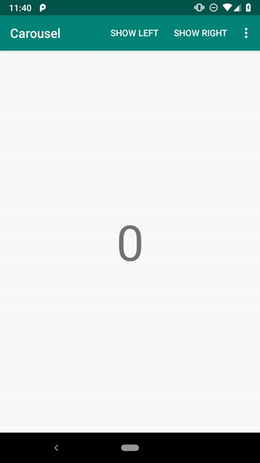

[](https://opensource.org/licenses/MIT) [](https://circleci.com/gh/SodaLabs/android-looping-pager-layoutmanager) [](https://jitpack.io/#sodalabs/android-looping-pager-layoutmanager)

A `RecyclerView.LayoutManager` library enabling you the looping pager layout (could swipe left or right) and supports AndroidX. It's pluggable and very lightweight unlike many other alternatives customizing a RecyclerView subclass.

<p align="center">
  
</p>

# Integration

### Gradle

[](https://jitpack.io/#sodalabs/android-looping-pager-layoutmanager)

```
dependencies {
    implementation 'com.github.sodalabs:android-looping-pager-layoutmanager:x.x.x'
}
```

# Usage

The library is very lightweight and provides:

* A custom LayoutManager, [LoopingPagerLayoutManager.kt](pager/src/main/java/co/sodalabs/pager/LoopingPagerLayoutManager.kt), which smartly knows where to place the item views so that you don't need to do the trick in the *Adapter* layer.
* A snap helper, [PagerSnapHelper.kt](pager/src/main/java/co/sodalabs/pager/PagerSnapHelper.kt), which follows the pluggable interface of RecyclerView and provides the snap scroll.


```kotlin
recyclerView.setHasFixedSize(true) // Currently necessary for programmatic smooth scroll
recyclerView.layoutManager = LoopingPagerLayoutManager() // One line to enable infinite looping.
recyclerView.adapter = ...

// Enable the snap on fling through the plugable interface.
// Use co.sodalabs.PagerSnapHelper not the one under AndroidX namespace!
val snapHelper = PagerSnapHelper(resources.displayMetrics.density, 500)
snapHelper.attachToRecyclerView(recyclerView)
```

> Note: Currently, `setHasFixedSize(true)` is very necessary otherwise the library won't layout the item views correctly.

# Code Owners

* @boyw165
* @xuhaibahmad
* @kevinmmarlow
